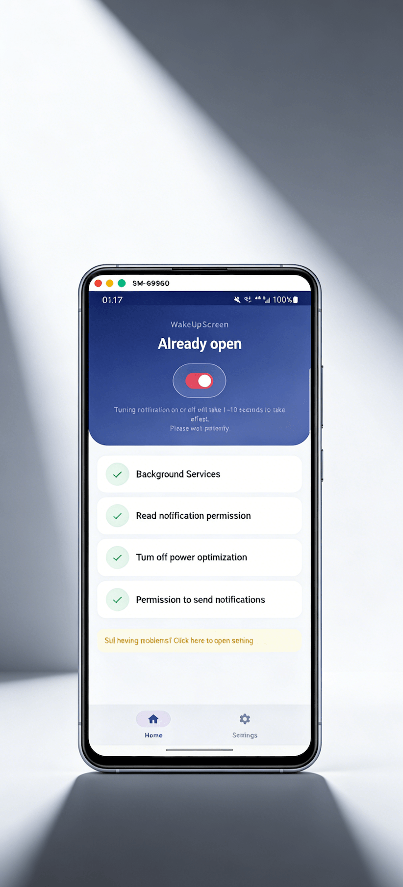

<div align="center">


# WakeUpScreen

**Il tuo schermo, sveglio quando conta.**

Un'app Android open-source che accende delicatamente il display nel momento in cui arriva una notifica.
Nessun cloud, nessun disordine, nessun compromesso.

[](https://play.google.com/store/apps/details?id=com.symeonchen.wakeupscreen)
[](https://github.com/riko2chen/WakeUpScreen)
[](https://riko2chen.github.io/WakeUpScreen/)
[](docs/CHANGELOG.md)
[](LICENSE)

[English](README.md) · [中文](README-zh.md) · [Italiano](README-it.md)

</div>

---

## Funzionalità

| | Funzione | Descrizione |
|---|---|---|
| :bell: | **Attivazione Istantanea** | Lo schermo si illumina nel momento in cui arriva una notifica. Non perdere mai ciò che conta mentre il telefono è sulla scrivania. |
| :sun_with_face: | **Modalità Tasca** | Rileva intelligentemente quando il telefono è in tasca o in borsa e resta spento. Risparmia batteria dove serve. |
| :mag: | **Filtro App** | Scegli esattamente quali app possono attivare lo schermo. Controllo totale su ciò che merita la tua attenzione. |
| :new_moon: | **Modalità Scura** | Un'interfaccia scura e raffinata, perfetta per qualsiasi display AMOLED. Delicata per gli occhi, leggera per la batteria. |
| :closed_lock_with_key: | **Nessun Internet** | Funziona interamente sul tuo dispositivo. Zero dati raccolti, zero server contattati. La tua privacy è assoluta. |
| :zap: | **Leggera** | Impatto minimo, consumo di batteria trascurabile. Sviluppata in Kotlin per prestazioni native che funzionano e basta. |

## Come Funziona

```
1. Installa e concedi il permesso
   └─ Serve solo l'accesso alle notifiche. Nessun altro permesso necessario.
      I tuoi dati non lasciano mai il dispositivo.

2. Scegli le tue app
   └─ Seleziona quali app possono attivare lo schermo. Lascia passare i messaggi
      importanti, filtra il rumore. Regola in qualsiasi momento.

3. Ecco fatto — vivi la tua vita
   └─ WakeUpScreen funziona silenziosamente in background. Quando arriva una notifica,
      lo schermo si accende. Quando il telefono è in tasca, resta spento. Semplice.
```

## Screenshot

<div align="center">

</div>

## Stack Tecnologico

- **Linguaggio**: Kotlin
- **UI**: Jetpack Compose
- **SDK Minimo**: Android 6.0 (API 23)
- **Architettura**: MVVM

## Compilazione

```bash
git clone https://github.com/riko2chen/WakeUpScreen.git
cd WakeUpScreen
./gradlew assembleDebug
```

## Contribuire

I contributi sono benvenuti! Sentiti libero di aprire issue o inviare pull request.

## Licenza

Questo progetto è rilasciato sotto la [GNU General Public License v3.0](LICENSE).

---

<div align="center">

**WakeUpScreen** di [Riko Studio](mailto:symeonchen@gmail.com)

*Costruito apertamente. La trasparenza non è opzionale.*

<sub>Precedentemente ospitata su <https://github.com/SymeonChen/WakeUpScreen> — quell'URL reindirizza ancora qui. Stesso account, username precedente.</sub>

</div>
