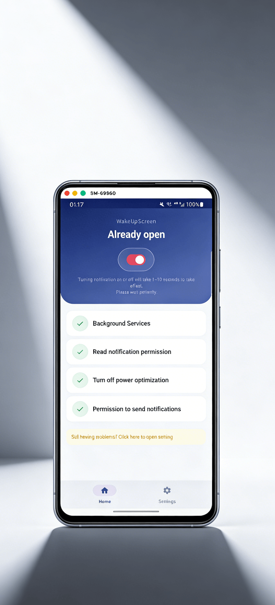

<div align="center">


# ปลุกหน้าจอ（WakeUpScreen）

**หน้าจอของคุณ ตื่นในจังหวะที่สำคัญ**

แอป Android โอเพนซอร์สที่ปลุกหน้าจอให้สว่างขึ้นทันทีที่มีการแจ้งเตือนเข้ามา
ดูแลต่อเนื่องมาตั้งแต่ปี 2019 มีผู้ใช้มากกว่า 10,000 คนใน 119 ประเทศและภูมิภาค

[](https://play.google.com/store/apps/details?id=com.symeonchen.wakeupscreen)
[](https://github.com/riko2chen/WakeUpScreen)
[](https://riko2chen.github.io/WakeUpScreen/)
[](docs/CHANGELOG-th.md)
[](LICENSE)

[English](README.md) · [简体中文](README-zh.md) · [繁體中文](README-zh-TW.md) · [Italiano](README-it.md) · [日本語](README-ja.md) · [한국어](README-ko.md) · [ไทย](README-th.md)

</div>

---

## คุณสมบัติ

| คุณสมบัติ | รายละเอียด |
|---|---|
| **ปลุกทันที** | หน้าจอสว่างขึ้นทันทีที่มีการแจ้งเตือน |
| **โหมดในกระเป๋า** | ตรวจจับได้ว่าเครื่องอยู่ในกระเป๋าเสื้อหรือกระเป๋าถือ แล้วปล่อยให้หน้าจอดับไว้ |
| **เตือนซ้ำ** | สว่างซ้ำทุก 5–60 นาที ตราบใดที่ยังมีการแจ้งเตือนค้างอยู่ |
| **กำหนดเวลาเปิดหน้าจอเอง** | เปิดหน้าจอไว้ 5 ถึง 30 วินาทีแทนการหมดเวลาหน้าจอของระบบ |
| **กรองแอป** | เลือกได้อย่างเจาะจงว่าแอปไหนปลุกหน้าจอได้ |
| **สถิติความสนใจ** | นับอยู่ในเครื่องว่าในรอบ 30 วันที่ผ่านมา แอปไหนปลุกหน้าจอแล้วไม่เคยถูกเปิดดูเลย |
| **บันทึกการแจ้งเตือน** | บันทึกทุกการแจ้งเตือนว่าปลุกหน้าจอหรือไม่และถูกกฎข้อไหนสกัด พร้อมแผนภาพกระบวนการตรวจสอบแบบเรียลไทม์ |
| **โหมดมืด** | หน้าตาโหมดมืดที่เข้ากับจอ AMOLED |
| **ไม่ต้องต่อเน็ต** | ทำงานอยู่ในเครื่องทั้งหมด ไม่เก็บข้อมูลและไม่ติดต่อเซิร์ฟเวอร์ |
| **เบา** | ใช้ทรัพยากรน้อยมากและแทบไม่กระทบแบตเตอรี่ |

## วิธีใช้งาน

```
1. ติดตั้งและให้สิทธิ์
   └─ ต้องการแค่สิทธิ์เข้าถึงการแจ้งเตือน ข้อมูลของคุณไม่ออกจากเครื่องเลย

2. เลือกแอป
   └─ เลือกว่าแอปไหนปลุกหน้าจอได้ ปล่อยข้อความสำคัญผ่าน
      แล้วกรองส่วนที่รบกวนออก ปรับเปลี่ยนได้ตลอดเวลา

3. เท่านี้เอง — ใช้ชีวิตต่อได้เลย
   └─ WakeUpScreen ทำงานเงียบ ๆ อยู่เบื้องหลัง มีแจ้งเตือนก็สว่างขึ้น
      อยู่ในกระเป๋าก็ดับไว้ ง่ายแค่นั้น
```

> **เรื่องสิทธิ์การเข้าถึง** สิทธิ์เดียวที่แอปต้องใช้เพื่อทำงานคือการเข้าถึงการแจ้งเตือน และแอปไม่ขอสิทธิ์
> อินเทอร์เน็ตเลย ข้อยกเว้นเดียวคือ "กำหนดเวลาเปิดหน้าจอเอง" เพราะบน Android 9 ขึ้นไป มีเพียงบริการ
> การช่วยเหลือพิเศษเท่านั้นที่ปิดหน้าจอก่อนกำหนดได้ ฟีเจอร์นี้จึงขอสิทธิ์ดังกล่าว โดยปิดไว้เป็นค่าเริ่มต้น
> บริการนี้ไม่อ่านเนื้อหาบนหน้าจอใด ๆ และฟีเจอร์อื่นทั้งหมดทำงานได้ตามปกติโดยไม่ต้องให้สิทธิ์นี้

## คุณสมบัติเพิ่มเติม

ทั้งหมดนี้เปิดหรือปิดได้ตามใจ

- **โหมดนอนหลับ** — ตั้งช่วงเวลาเงียบได้หลายช่วงต่อวัน ละเอียดถึงระดับนาที และจำกัดเฉพาะบางวันในสัปดาห์ได้
- **แสงเรืองยามค่ำ** — ในช่วงเวลานอน จะแสดงแสงสีแดงสลัวแวบหนึ่งแทนความมืดสนิท
- **เงียบเมื่อแบตต่ำ** — เมื่อแบตต่ำกว่าระดับที่ตั้งไว้และไม่ได้ชาร์จอยู่ จะไม่ปลุกหน้าจอ
- **เงียบเมื่อคว่ำเครื่อง** — ขณะที่วางเครื่องคว่ำหน้าจอลง จะปล่อยให้หน้าจอดับไว้
- **ตรวจจับห้ามรบกวน** — หยุดปลุกหน้าจอขณะที่โหมดห้ามรบกวนของระบบเปิดอยู่
- **เฉพาะตอนชาร์จ** — ปลุกหน้าจอเฉพาะตอนที่เสียบสายชาร์จอยู่เท่านั้น
- **กรองการแจ้งเตือนค้าง** — ข้ามการแจ้งเตือนที่ค้างอยู่นาน เช่น นำทางและเพลง
- **สำรองการตั้งค่า** — ส่งออกและนำเข้าการตั้งค่าทั้งหมดเป็นไฟล์ JSON โดยไม่ต้องขอสิทธิ์เพิ่ม
- **ทดสอบการปลุก** — สั่งปลุกหน้าจอหรือเตือนซ้ำหนึ่งรอบได้ทันที ไม่ต้องรอการแจ้งเตือนจริง

## ภาพหน้าจอ

<div align="center">

</div>

## ความเข้ากันได้

- **รองรับตั้งแต่**: Android 6.0 ขึ้นไป
- **รองรับล่าสุด**: Android 16
- **ภาษา**: ไทย, English, 简体中文, 繁體中文, Italiano, 日本語, 한국어

## ร่วมพัฒนา

ยินดีรับการมีส่วนร่วม เปิด Issue หรือส่ง Pull Request ได้เลย

## สัญญาอนุญาต

โปรเจกต์นี้เผยแพร่ภายใต้ [GNU General Public License v3.0](LICENSE) คุณใช้ ศึกษา แก้ไข และแบ่งปันได้
อย่างอิสระ แต่สิ่งที่นำไปเผยแพร่ต่อก็ต้องเป็นโอเพนซอร์สภายใต้เงื่อนไขเดียวกัน

---

<div align="center">

**WakeUpScreen** โดย [Riko Lab](mailto:symeonchen@gmail.com)

<sub>ที่อยู่เดิมของโปรเจกต์: <https://github.com/SymeonChen/WakeUpScreen> — ลิงก์นั้นยังเปลี่ยนเส้นทางมาที่นี่ บัญชีเดียวกัน เป็นชื่อผู้ใช้เดิม</sub>

</div>
