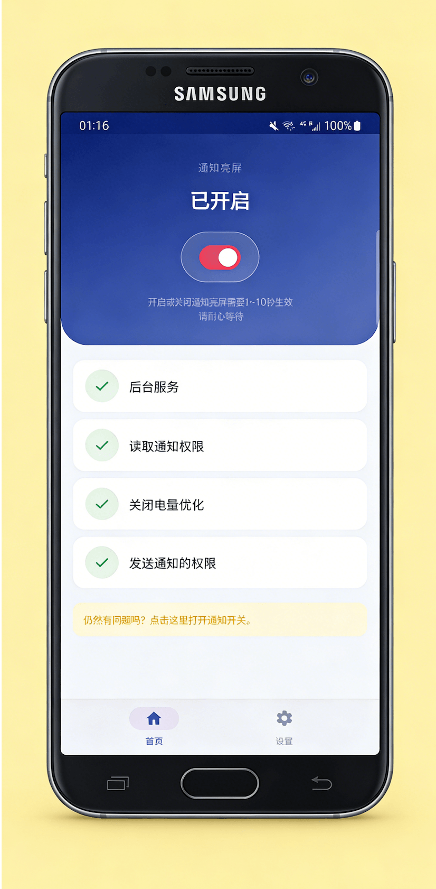

<div align="center">


# 通知亮屏（WakeUpScreen）

**螢幕，在重要時刻為你亮起。**

一款開源 Android 應用程式，收到通知時自動點亮螢幕。
自 2019 年起持續維護，在 119 個國家和地區超過 10,000 名使用者用過。

[](https://play.google.com/store/apps/details?id=com.symeonchen.wakeupscreen)
[](https://github.com/riko2chen/WakeUpScreen)
[](https://riko2chen.github.io/WakeUpScreen/)
[](docs/CHANGELOG-zh-TW.md)
[](LICENSE)

[English](README.md) · [简体中文](README-zh.md) · [繁體中文](README-zh-TW.md) · [Italiano](README-it.md) · [日本語](README-ja.md) · [한국어](README-ko.md) · [ไทย](README-th.md)

</div>

---

## 功能特色

| 功能 | 說明 |
|---|---|
| **即時亮螢幕** | 收到通知的瞬間螢幕自動亮起。 |
| **口袋模式** | 偵測到手機在口袋或包包裡時，保持螢幕熄滅。 |
| **重複提醒** | 通知還沒處理完，每隔 5～60 分鐘再亮一次。 |
| **自訂亮螢幕時間** | 螢幕亮 5 到 30 秒後熄滅，不走系統的螢幕逾時。 |
| **應用程式篩選** | 精確選擇哪些應用程式可以亮螢幕。 |
| **注意力統計** | 在本機統計最近 30 天裡點亮了螢幕卻從沒被看一眼的應用程式。 |
| **通知記錄** | 記錄每則通知亮沒亮螢幕、被哪條規則擋下，並配有即時的檢查流程圖。 |
| **深色模式** | 搭配 AMOLED 螢幕的深色介面。 |
| **無需網路** | 完全在本機執行，不蒐集資料，不連線伺服器。 |
| **輕量** | 資源占用極小，幾乎無感的耗電量。 |

## 設計理念

三星的訊息通知策略較偏向 Always on Display，而本應用程式偏向平常關閉螢幕、收到通知時再點亮，類似 iOS 以及 MIUI 等系統的做法。

與同類應用程式相比，本應用程式有三個核心優勢：**開源**、**無需網路**、**無廣告**。

## 使用方式

```
1. 安裝並授權
   └─ 僅需通知存取權限來監聽傳入的通知，資料永遠不會離開你的裝置。

2. 選擇應用程式
   └─ 選擇哪些應用程式可以喚醒螢幕。放行重要訊息，過濾無關干擾。隨時可調整。

3. 就這樣，盡情生活
   └─ WakeUpScreen 在背景靜默執行。收到通知時螢幕自動亮起，
      手機在口袋裡時保持熄滅。就這麼簡單。
```

> **關於權限。** 應用程式運作只需要通知存取權限，且完全不申請網路權限。唯一的例外是「自訂亮螢幕時間」：
> 在 Android 9 以上，提前熄滅螢幕只有無障礙服務做得到，所以這一個功能會請求無障礙授權。它預設關閉，
> 該服務不讀取任何螢幕內容，其餘功能不授權也照常運作。

## 更多功能

以下功能皆可自由開啟或關閉：

- **睡眠模式** — 一天可設多個免打擾時段，精確到分鐘，還能只在指定星期生效
- **夜間微光** — 睡眠時段內，用一瞬間的暗紅微光代替全黑
- **低電量靜默** — 電量低於設定值且未充電時，不再亮螢幕
- **正面朝下靜默** — 手機螢幕朝下放置時，保持熄滅
- **勿擾偵測** — 手機開啟勿擾模式時，自動暫停亮螢幕功能
- **僅充電時** — 只在手機接著電源的時候亮螢幕
- **持續通知最佳化** — 自動忽略導航、音樂等長駐通知的亮螢幕行為
- **設定備份** — 全部設定匯出、匯入為 JSON 檔案，無需額外權限
- **喚醒測試** — 不用等通知，當場觸發一次亮螢幕，或者一輪重複提醒

## 螢幕截圖

<div align="center">

</div>

## 相容性

- **最低支援**：Android 6.0
- **最新適配**：Android 16
- **語言**：繁體中文、简体中文、English、Italiano、日本語、한국어、ไทย

## 貢獻

歡迎貢獻！可以提交 Issue 或 Pull Request。

## 授權條款

本專案基於 [GNU 通用公眾授權條款 v3.0](LICENSE) 開源 —— 你可以自由使用、研究、修改與散布本專案，
但由它衍生出去的作品必須同樣以 GPL v3 開源。

---

<div align="center">

**WakeUpScreen** by [Riko Lab](mailto:symeonchen@gmail.com)

<sub>原儲存庫位址：<https://github.com/SymeonChen/WakeUpScreen> —— 該連結仍可存取並自動跳轉至目前位址。同一帳號，僅為曾用名。</sub>

</div>
