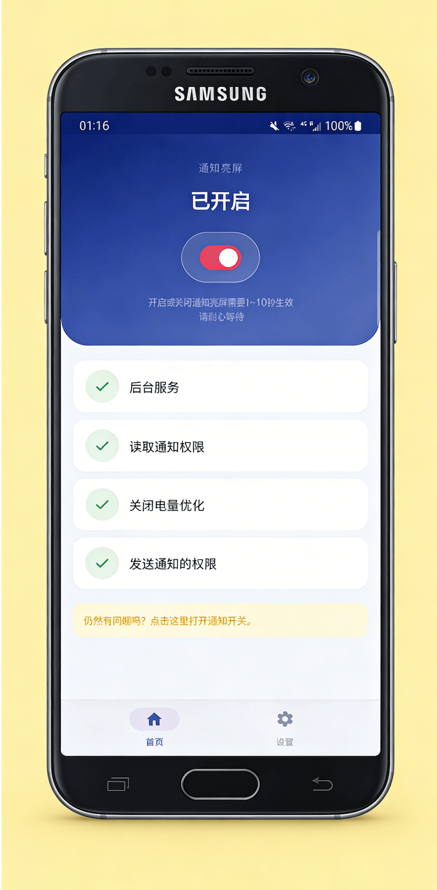

<div align="center">


# 通知亮屏（WakeUpScreen）

**屏幕，在重要时刻为你亮起。**

一款开源 Android 应用，收到通知时自动点亮屏幕。
无云服务、无冗余、零妥协。

[](https://play.google.com/store/apps/details?id=com.symeonchen.wakeupscreen)
[](https://github.com/SymeonChen/WakeUpScreen)
[](https://riko2chen.github.io/WakeUpScreen/)
[](docs/CHANGELOG-zh.md)
[](LICENSE)

[English](README.md) · [中文](README-zh.md) · [Italiano](README-it.md)

</div>

---

## 功能特性

| | 功能 | 描述 |
|---|---|---|
| :bell: | **即时亮屏** | 收到通知的瞬间屏幕自动亮起。手机放在桌上也不会错过重要信息。 |
| :sun_with_face: | **口袋模式** | 智能检测手机是否在口袋或包中，自动保持息屏。省电从细节做起。 |
| :mag: | **应用筛选** | 精确选择哪些应用可以亮屏。完全掌控什么值得你的关注。 |
| :new_moon: | **深色模式** | 精美的深色界面，完美适配 AMOLED 屏幕。护眼又省电。 |
| :closed_lock_with_key: | **无需网络** | 完全在设备本地运行。零数据采集，零服务器连接。你的隐私得到绝对保障。 |
| :zap: | **轻量级** | 极小的资源占用，几乎无感的电量消耗。基于 Kotlin 开发，原生性能开箱即用。 |

## 设计理念

三星的消息通知策略更倾向于 Always on Display，而本应用则倾向于在平常关闭屏幕，收到通知时再点亮，类似于 iOS 以及 MIUI 等系统的表现形式。

与类似应用相比，本应用有三个核心优势：
- **开源** — 遵循 GPL 协议，所有代码完全公开
- **无需网络** — 不申请网络权限，让使用者安心放心
- **无广告** — 纯粹为需求而生，没有盈利压力

## 使用方法

```
1. 安装并授权
   └─ 仅需通知访问权限来监听传入通知。无需其他权限，数据永远不会离开你的设备。

2. 选择应用
   └─ 选择哪些应用可以唤醒屏幕。放行重要消息，过滤无关干扰。随时可调整。

3. 就这样，尽情生活
   └─ WakeUpScreen 在后台静默运行。收到通知时屏幕自动亮起，
      手机在口袋里时保持息屏。就这么简单。
```

## 更多功能

以下功能均可自由开启或关闭：

- **自定义亮屏时间** — 本功能在部分设备上不可用
- **免打扰侦测** — 手机开启免打扰时，自动暂停亮屏功能
- **睡眠模式** — 自定义夜间暂停亮屏的时间段
- **持续通知优化** — 自动忽略导航、音乐等长驻通知的亮屏行为

## 截图

<div align="center">

</div>

## 技术栈

- **语言**: Kotlin
- **界面**: Jetpack Compose
- **最低版本**: Android 6.0 (API 23)
- **架构**: MVVM

## 构建

```bash
git clone https://github.com/SymeonChen/WakeUpScreen.git
cd WakeUpScreen
./gradlew assembleDebug
```

## 贡献

欢迎贡献！可以提交 Issue 或 Pull Request。

## 许可证

本项目基于 [GNU 通用公共许可证 v3.0](LICENSE) 开源。

---

<div align="center">

**WakeUpScreen** by [Riko Studio](mailto:symeonchen@gmail.com)

*透明开放地构建。透明不是可选项。*

</div>
